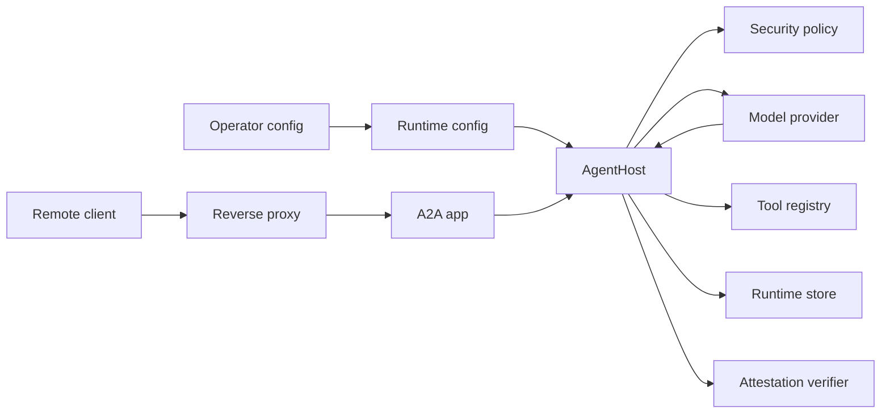

# Portmark Threat Model

## Executive Summary

Portmark is a provider-neutral portable-agent runtime with three high-risk security themes: accepting signed remote work over A2A, letting untrusted providers propose tool actions, and preserving audit integrity across durable stores and migration. The strongest current controls are signed envelopes, policy and permit intersection, bounded request and output sizes, optional attestation, signed audit heads, and authenticated metrics. The main residual risks are deployment misconfiguration around public exposure and secrets, trust in operator-loaded Python tools, and deployment-supplied attestation verifier quality.

## Scope And Assumptions

In scope:

- Runtime host, policy, provider, tool, storage, attestation, approval, and A2A paths under `src/portmark/`.
- Deployment guidance under `Dockerfile`, `DEPLOYMENT.md`, `OPERATIONS.md`, and `deploy/nginx/portmark.conf`.
- Tests and examples when they prove or demonstrate runtime security behavior.

Out of scope:

- A full audit of the optional `a2a-sdk`, `uvicorn`, `psycopg`, `cryptography`, Node.js, or wasmtime internals.
- Production secret-manager, cloud IAM, TLS certificate, and database hardening outside this repository.
- Correctness of deployment-specific TEE quote verifiers supplied through `PORTMARK_ATTESTATION_VERIFIER_COMMAND`.

Assumptions:

- Public deployments put Portmark behind a production reverse proxy and do not expose the reference CLI server directly.
- `PORTMARK_A2A_TOKEN`, signing keys, trust registries, policy files, and database credentials are operator-controlled secrets/configuration.
- Remote model providers and Wasm capsules are untrusted decision engines; the host remains the enforcement point.
- Custom tools are trusted host code loaded by operators, but tool arguments and provider decisions are untrusted.
- SQLite is the local/default store. Postgres is optional and selected explicitly with `PORTMARK_STORE_BACKEND=postgres`.

Open questions that can change risk ranking:

- Whether production deployments are single-tenant or multi-tenant.
- Whether checkpoints or tool outputs include regulated data, credentials, or customer secrets.
- Which real attestation platform and verifier implementation will be used.

## System Model

### Primary Components

- CLI and ASGI entrypoints: parse operator configuration, build hosts, serve A2A requests, and expose health, readiness, and metrics. Evidence: `src/portmark/cli.py`, `src/portmark/asgi.py`, `src/portmark/a2a.py`.
- `AgentHost`: verifies envelopes, computes effective permits, gates attestation and approvals, asks providers for decisions, invokes tools, records audit events, and persists checkpoints. Evidence: `src/portmark/host.py`.
- Security policy and signing layer: validates trust registry keys, signatures, permits, argument constraints, approval tokens, attestation evidence, and audit-head signatures. Evidence: `src/portmark/security.py`, `src/portmark/policy.py`.
- Provider adapters: deterministic demo, generic HTTP provider, Node Wasm provider, and native Wasmtime component provider. Evidence: `src/portmark/providers.py`, `src/portmark/component_bindings.py`.
- Tool registry and loader: loads host-installed Python tool registries and invokes tools with policy constraints, timeout, JSON serialization, and output caps. Evidence: `src/portmark/tool_loading.py`, `src/portmark/tools.py`.
- Runtime stores: in-memory, SQLite, and optional Postgres implementations for nonces, checkpoints, audit events, and signed audit heads. Evidence: `src/portmark/storage.py`.

### Data Flows And Trust Boundaries

- Internet or proxy -> A2A ASGI app: JSON-RPC envelopes and bearer tokens over HTTP. Controls: loopback-only reference serving, reverse proxy requirement, bearer auth for `/message:send` and `/metrics`, request-size cap, per-IP rate limits, generic errors. Evidence: `src/portmark/a2a.py`, `DEPLOYMENT.md`, `deploy/nginx/portmark.conf`.
- Operator CLI/env/files -> runtime config: signing keys, store paths/DSNs, policy path, trust registry path, custom tool loader, attestation verifier command. Controls: shell-free attestation argv parsing, explicit custom-tool policy requirement, JSON policy/trust registry validation. Evidence: `src/portmark/config.py`, `src/portmark/cli.py`, `src/portmark/policy.py`.
- A2A envelope -> host security layer: signed manifest, permit, state, previous audit head, and optional attestation. Controls: Ed25519 trust registry, audience and expiry checks, nonce consumption, audit-head signature verification. Evidence: `src/portmark/security.py`, `src/portmark/host.py`.
- Host -> provider: projected state and available tool names. Controls: provider projection hides ungranted tool messages and narrows returned tool output fields. Evidence: `src/portmark/providers.py`, `src/portmark/projection.py`.
- Provider -> host: provider decision JSON or Wasm return payload. Controls: response size cap, JSON/schema validation, allowed decision kinds, host-side permit and policy checks. Evidence: `src/portmark/providers.py`, `src/portmark/host.py`.
- Host -> tool: tool name and arguments proposed by provider. Controls: grant intersection, host policy constraints, approval tokens for high-impact tools, timeout, exception isolation, output serialization and size cap. Evidence: `src/portmark/security.py`, `src/portmark/tools.py`, `src/portmark/host.py`.
- Host -> runtime store: nonce records, checkpoints, audit events, signed audit heads. Controls: transactions, uniqueness constraints, contiguous audit sequence checks, signed audit-head verification, three-state verifier. Evidence: `src/portmark/storage.py`.
- Host -> external attestation verifier: canonical JSON evidence through stdin to an operator-supplied argv command. Controls: no shell, empty environment, timeout, stdout cap, generic rejection. Evidence: `src/portmark/security.py`, `ATTESTATION.md`.

#### Diagram

## Assets And Security Objectives

| Asset | Why It Matters | Security Objective |
| --- | --- | --- |
| Envelope signing keys | Authorize agents and audit heads | C/I |
| Trust registry | Defines accepted signing identities | I |
| Host policy | Defines allowed tools, budgets, impacts, approvals | I |
| Approval authority keys and tokens | Gate high-impact tool actions | C/I |
| Attestation trust roots and measurements | Gate sensitive execution and migration | I |
| A2A bearer token | Protects remote submission and metrics endpoints | C/I |
| Provider input/output | May contain task goals, tool results, and sensitive context | C/I |
| Tool arguments and outputs | Can trigger external side effects or data exposure | C/I/A |
| Runtime store checkpoints | Persist agent state and potentially sensitive data | C/I/A |
| Audit events and signed heads | Evidence for tampering and migration provenance | I |
| Host compute and network capacity | Needed to avoid request or tool execution DoS | A |
| CI and dependency lockfiles | Influence shipped dependencies and supply chain | I |

## Attacker Model

### Capabilities

- Send arbitrary HTTP requests to a deployed A2A endpoint if the reverse proxy exposes it.
- Obtain or influence model-provider outputs, including malicious tool decisions.
- Submit signed envelopes only if the attacker controls or compromises a trusted signing key.
- Attempt replay, tampering, oversized bodies, malformed JSON, invalid signatures, and rate-limit pressure.
- Influence tool arguments through provider decisions within whatever envelope and policy grants allow.
- Read public repository docs, examples, CI config, and container metadata.

### Non-Capabilities

- Cannot bypass Ed25519 verification without a trusted private key or trust-registry compromise.
- Cannot directly execute custom Python tools unless an operator installs and grants them.
- Cannot control the attestation verifier command unless they compromise operator configuration.
- Cannot read host environment secrets through Wasm capsules under the intended no-import sandbox model.
- Cannot access the runtime store unless deployment database credentials or filesystem permissions are compromised.

## Entry Points And Attack Surfaces

| Surface | How Reached | Trust Boundary | Notes | Evidence |
| --- | --- | --- | --- | --- |
| `POST /message:send` | A2A HTTP JSON-RPC | Remote client to host | Main remote execution request path | `src/portmark/a2a.py` `admit_post`, `dispatch_post` |
| `GET /.well-known/agent-card.json` | A2A HTTP GET | Remote client to metadata | Rate-limited unauthenticated metadata | `src/portmark/a2a.py` `handle_get` |
| `GET /metrics` | HTTP GET with bearer token | Operator monitoring to host | Authenticated JSON or Prometheus metrics | `src/portmark/a2a.py` `handle_get` |
| `GET /healthz`, `GET /readyz` | HTTP GET | Platform probes to host | Generic readiness failure | `src/portmark/a2a.py` `ready` |
| CLI config/env | `portmark` commands and env vars | Operator to runtime | Includes key, policy, store, and tool settings | `src/portmark/cli.py`, `src/portmark/config.py` |
| Trust registry loader | JSON file | Operator file to security layer | Controls trusted envelope and audit-head signers | `src/portmark/security.py` `load_trust_registry` |
| Policy loader | JSON file | Operator file to policy layer | Controls tools, budgets, impacts, approvals | `src/portmark/policy.py` |
| Custom tool loader | `--tools module:function` | Operator code to host runtime | Imports Python modules without shell | `src/portmark/tool_loading.py` |
| Generic HTTP provider | Configured endpoint | Host to remote model gateway | Sends projected state and receives decisions | `src/portmark/providers.py` |
| Wasm providers | Component file | Capsule to host | Runs provider code under Node or wasmtime path | `src/portmark/providers.py`, `src/portmark/wasm_runner.mjs` |
| Example HTTP fetch tool | Granted tool invocation | Provider decision to outbound network | Enforces HTTPS, no redirects, output cap | `examples/tools/http_fetch.py` |
| Runtime store | SQLite/Postgres | Host to durable state | Stores nonces, checkpoints, audit chains | `src/portmark/storage.py` |
| External attestation verifier | Subprocess argv | Host to deployment verifier | No shell, empty env, bounded stdout | `src/portmark/security.py` `ExternalAttestationVerifier` |

## Top Abuse Paths

1. Remote request flood -> proxy or A2A endpoint accepts too many requests -> provider/tool work consumes threads or CPU -> legitimate agent submissions fail.
2. Compromised provider -> proposes a high-impact tool call -> host misses policy/approval/argument guard -> external payment or data-exfiltration tool runs.
3. Operator installs unsafe custom tool -> provider supplies attacker-controlled arguments -> tool performs SSRF or credential-bearing response -> secrets leave host boundary.
4. Attacker obtains signing key -> signs valid envelopes for a trusted issuer/audience -> host accepts attacker-defined work within policy grants -> tools and state are abused.
5. Attacker tampers with audit store -> changes event history or audit head -> verifier misses inconsistency -> fabricated history is accepted as valid.
6. Malicious remote provider response -> oversized or malformed decision -> host buffers too much or accepts unsupported shape -> DoS or policy bypass.
7. Weak attestation verifier -> accepts forged quote or wrong measurement -> migration releases checkpoint to an untrusted destination host.
8. Approval token leak or replay -> attacker reuses approval for different task, arguments, or policy -> high-impact tool executes without fresh consent.

## Threat Model Table

| Threat ID | Threat Source | Prerequisites | Threat Action | Impact | Impacted Assets | Existing Controls | Gaps | Recommended Mitigations | Detection Ideas | Likelihood | Impact Severity | Priority |
| --- | --- | --- | --- | --- | --- | --- | --- | --- | --- | --- | --- | --- |
| TM-001 | Remote client | A2A endpoint reachable through proxy or loopback tunnel | Flood message, metadata, or metrics routes | Service DoS | Host compute, A2A availability | Request cap, per-IP rate limit, connection cap, reverse proxy guidance (`a2a.py`, `deploy/nginx/portmark.conf`) | In-process limiter is per-process and not distributed | Add deployment task for shared edge rate limiting in multi-replica deployments | Alert on `portmark_refusals_total{reason="rate_limited"}` and request duration | Medium | Medium | Medium |
| TM-002 | Malicious provider | Provider endpoint or capsule can influence decisions | Propose unauthorized tool, arguments, or migration | Tool side effects, data leak | Tools, checkpoints, policy | Permit/policy intersection, tool grant checks, approval gate, constraints (`host.py`, `security.py`) | Provider output schema is custom and should be cross-checked against any official A2A evolution | Add compatibility review task whenever adopting new provider/A2A schemas | Alert on security rejections and invalid provider decisions | Medium | High | High |
| TM-003 | Unsafe custom tool | Operator loads tool code and grants policy | Tool performs SSRF, leaks credentials, or ignores constraints internally | Data exfiltration or network abuse | Secrets, network, tool outputs | Loader validates `ToolRegistry`, policy required for custom tools, host constraints before invocation (`tool_loading.py`, `tools.py`) | Loaded Python tools run in host process with ambient privileges | Add task for optional subprocess/container tool isolation for untrusted tools | Track high-risk tool failures and unexpected egress | Medium | High | High |
| TM-004 | Key thief or config attacker | Private signing key or trust registry compromised | Sign malicious envelopes or trust a malicious key | Unauthorized agent execution | Signing keys, trust registry, tools | Ed25519 trust registry, key validity windows, revocation (`security.py`) | No built-in key rotation CLI workflow beyond key generation | Add task for documented rotation and revocation runbook with tests | Alert on unknown key IDs, revoked key attempts, signature failures | Low | High | Medium |
| TM-005 | Store tamperer | Database or filesystem write access | Modify audit events, checkpoints, nonces, or heads | Integrity loss, replay, false audit | Runtime store, audit logs | Transactions, uniqueness, signed audit heads, three-state verifier (`storage.py`) | Checkpoints are not encrypted or separately MACed | Add task for optional checkpoint encryption/MAC tied to deployment key management | Periodic `verify-audit` jobs and audit-head mismatch alerts | Low | High | Medium |
| TM-006 | Malicious provider endpoint | Host configured to remote provider | Return oversized, malformed, or adversarial decisions | DoS or policy bypass attempt | Provider adapter, host loop | Bounded reads, JSON parsing, decision validation (`providers.py`) | Endpoint can be plain HTTP for local gateways | Add task to document/optionally enforce HTTPS for non-loopback provider endpoints | Alert on provider failures and response-limit refusals | Medium | Medium | Medium |
| TM-007 | Weak attestation verifier | External verifier configured incorrectly | Accept wrong quote, stale measurement, or wrong subject | Migration to untrusted host | Checkpoints, attestation roots | Subject, audience, expiry, measurement, nonce, signature/external verifier checks (`security.py`, `ATTESTATION.md`) | No shipped platform verifier | Add task for at least one real platform verifier integration or conformance harness | Log and alert on attestation rejection reasons | Medium | High | High |
| TM-008 | Approval token attacker | Token leaked into checkpoint or operator channel | Replay or mutate approval token | High-impact tool misuse | Approval tokens, tools | Token binds tool, subject, audience, task, nonce, args hash, policy hash; replay list (`security.py`, `host.py`) | Used approvals live in checkpoint state, not a dedicated durable table | Add task for durable approval-use index independent of mutable checkpoint content | Alert on approval denied/replayed events | Low | High | Medium |

## Criticality Calibration

- Critical: unauthenticated remote execution; arbitrary host code execution from provider data; bypass of signature verification for trusted envelopes; silent audit verification success after fabricated history.
- High: high-impact tool execution without policy/approval; migration to untrusted host due to bad attestation; custom tool SSRF that can reach credentials; leakage of signing keys or A2A token.
- Medium: request or provider DoS bounded by process limits; metrics or logs losing security signal; replay rejected only after consuming availability; HTTP provider used without TLS on a non-loopback network.
- Low: agent-card metadata disclosure; generic readiness status disclosure; local demo-only HMAC misuse when unsafe flag is not enabled.

## Focus Paths For Security Review

| Path | Why It Matters | Related Threat IDs |
| --- | --- | --- |
| `src/portmark/a2a.py` | Main network boundary, auth, rate limits, body caps, error shaping | TM-001, TM-002 |
| `deploy/nginx/portmark.conf` | Reference public exposure boundary and edge limits | TM-001 |
| `src/portmark/tool_loading.py` | Operator-controlled custom code loading | TM-003 |
| `src/portmark/tools.py` | Host-side tool timeout, constraints, output cap, exception isolation | TM-002, TM-003 |
| `examples/tools/http_fetch.py` | Example side-effecting network tool and SSRF posture | TM-003 |
| `src/portmark/providers.py` | Remote provider and Wasm provider parsing and limits | TM-002, TM-006 |
| `src/portmark/projection.py` | Controls what provider can see from prior tool outputs | TM-002, TM-006 |
| `src/portmark/security.py` | Trust registry, signatures, approvals, constraints, attestation | TM-004, TM-007, TM-008 |
| `src/portmark/host.py` | Central enforcement loop and migration flow | TM-002, TM-005, TM-008 |
| `src/portmark/storage.py` | Durable replay prevention and audit verification | TM-005 |
| `src/portmark/asgi.py` | Production app construction and readiness behavior | TM-001, TM-005 |
| `.github/workflows/ci.yml` | Regression, audit, and service-container coverage | TM-005, TM-006 |

## Residual Risks

- Custom Python tools execute in the host process and inherit host privileges. This is acceptable only for trusted operator-installed tools.
- The reference runtime does not provide a production TEE quote verifier. External verifier correctness is a deployment responsibility.
- Checkpoints and audit rows are integrity-checked through the audit chain, but checkpoint confidentiality depends on database and filesystem controls.
- In-process rate limiting is not sufficient as the only control in horizontally scaled deployments.
- Provider endpoints can be configured with `http` for local gateways; production operators must keep non-loopback provider traffic protected.
- `GET /.well-known/agent-card.json`, `/healthz`, and `/readyz` intentionally disclose limited operational metadata.
- A tool failing at call time ends the whole run, so one flaky upstream costs every other reading the agent had collected. Deliberate — see Recorded Decisions below.
- Two constraint sets that narrow the same argument in ways Portmark cannot prove are narrower cause the grant to be dropped rather than merged. Availability is traded for the guarantee that merging never creates authority.

## Recorded Decisions

### A failing tool ends the run (issue #17)

**Decision: abort stays the default, and there is currently no way to opt out.**

A tool that raises terminates the whole run. The audit chain shows
`tool.failed` followed immediately by `agent.failed`. An agent collecting from
three independent sources loses all three when one has a missing credential —
the remaining two are not refused, they are never attempted.

This was observed twice in one afternoon in the first real deployment: once from
an absent API key, once from an upstream HTTP 400.

**Why abort:** an agent whose tools partly failed is in a state the host cannot
reason about. Continuing means acting on information the host knows to be
incomplete, and every later decision inherits that. Fail-closed is the house
style, and the audit chain stays a straight line: every run either completed on
evidence the host can account for, or stopped.

**Why the other side is not silly:** a collector reading N independent sources
should arguably return N−1 when one is down. Losing everything makes a single
flaky upstream indistinguishable from a total outage, and a misconfigured permit
indistinguishable from an API being down.

**What settles it for now:** capability belongs in the permit, not in error
handling. If a credential is absent, withhold the grant rather than granting it
and failing — the permit then describes the host's real capability and the
failure never occurs. That covers every failure predictable before the run. It
does not cover an upstream that fails at call time, which is the genuine gap.

**If this is revisited**, the shape is a per-grant `on_failure: "abort" | "skip"`
declared in the permit, so the agent's *authority* states what it may tolerate
rather than the host guessing. It must satisfy:

- default `abort`, so today's behaviour holds for anyone who does not opt in;
- intersection rule **abort wins** — the same narrowing discipline as every other
  constraint, so a permit can never relax a policy that demands abort;
- a distinct, mandatory `tool.skipped` audit event. A silent skip trades a
  visible failure for an invisible one, which is strictly worse than the
  behaviour it replaces.

### Components have no host imports (issue #23)

**Decision: a Wasm component is a pure decision function with zero ambient host
access, and the WIT world must stay import-free.**

The `portmark` WIT world (`wit/portmark.wit`) exports one function, `resume`,
and imports nothing. The native runner instantiates the component against an
empty `wasmtime.component.Linker` (`src/portmark/wasmtime_component_runner.py`),
so a component cannot open a socket, touch the filesystem, or read host memory.
Its only channel to the outside world is *returning* a `tool-request`, which the
host then scopes through permit ∩ policy tool grants and `check_constraints`
(`allowed_*`, `max_*`, argument schema) in `src/portmark/security.py`.

This is why Portmark has no per-component "capabilities" block like a
manifest-based capsule system (the pattern that prompted issue #23): there is no
host-import surface to scope. The scoping lives at the tool layer, where the only
exercisable authority actually is.

**Enforcement:** `test_wit_world_declares_no_host_imports` fails if any `import`
is added to the world, and `test_wasm_with_ambient_wasi_import_cannot_instantiate`
proves a component that imports host functions cannot instantiate. If a future
design gives components direct host imports, both guards force the scoped
host-capability grant to be designed at that moment, not bolted on after.

## Quality Check

- Covered discovered runtime entry points: A2A message send, agent card, metrics, health, readiness, CLI, providers, tools, stores, attestation verifier.
- Covered each trust boundary in at least one threat row.
- Separated runtime surfaces from CI, tests, examples, and deployment configuration.
- Proceeded with explicit assumptions because no additional deployment context was provided in this phase.
- Residual risks are explicit and tied to concrete follow-up tasks.
